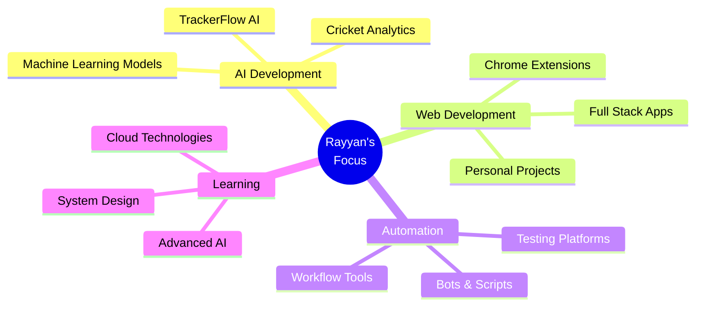

<div align="center">

# 👨‍💻 Rayyan Moosani


<p align="center">
  
</p>

[](https://github.com/Muhammad-Rayyan-Moosani)

</div>

---

## 🚀 About Me

```python
class RayyanMoosani:
    def __init__(self):
        self.username = "Muhammad-Rayyan-Moosani"
        self.role = "AI Engineer & Full Stack Developer"
        self.location = "🌍 Building the Future"
        self.interests = [
            "Artificial Intelligence",
            "Machine Learning",
            "Web Development",
            "Automation",
            "Cricket Analytics"
        ]
        self.current_focus = "Building AI-powered solutions"

    def say_hi(self):
        print("Thanks for dropping by! Let's build something amazing together!")

me = RayyanMoosani()
me.say_hi()
```

<div align="center">
  
</div>

---

## 🛠️ Tech Arsenal

<div align="center">

### 💻 Languages & Frameworks


### 🤖 AI & Data Science


<br/>


### 🗄️ Databases & Cloud


### 🔧 Tools & Technologies


</div>

<div align="center">
  
</div>

---

## 📊 GitHub Statistics

<div align="center">


</div>

<div align="center">
  
</div>

---

## 🎯 Featured Projects

<div align="center">

<a href="https://github.com/Muhammad-Rayyan-Moosani/TrackerFlow-AI">
  
</a>

<a href="https://github.com/Muhammad-Rayyan-Moosani/CrickAI-Vision">
  
</a>

<a href="https://github.com/Muhammad-Rayyan-Moosani/TestGuard-Platform">
  
</a>

<a href="https://github.com/Muhammad-Rayyan-Moosani/Personal-Website">
  
</a>

</div>

<div align="center">
  
</div>

---

## 💡 What I'm Up To

<div align="center">



</div>

---

## 🔥 Current Streak

<div align="center">
  
</div>

---

## 📫 Let's Connect!

<div align="center">

[](https://www.linkedin.com/in/rayyan-moosani)
[](mailto:rayyan.moosani@example.com)
[](https://your-portfolio-url.com)
[](https://twitter.com/yourhandle)

</div>

---

<div align="center">

### 💭 Random Dev Quote


### 🐍 Contribution Snake

<picture>
  <source media="(prefers-color-scheme: dark)" srcset="https://raw.githubusercontent.com/Muhammad-Rayyan-Moosani/Muhammad-Rayyan-Moosani/output/github-contribution-grid-snake-dark.svg">
  <source media="(prefers-color-scheme: light)" srcset="https://raw.githubusercontent.com/Muhammad-Rayyan-Moosani/Muhammad-Rayyan-Moosani/output/github-contribution-grid-snake.svg">
  
</picture>

</div>

---

<div align="center">
  

  ### ⭐ From [Muhammad-Rayyan-Moosani](https://github.com/Muhammad-Rayyan-Moosani)

  
</div>
