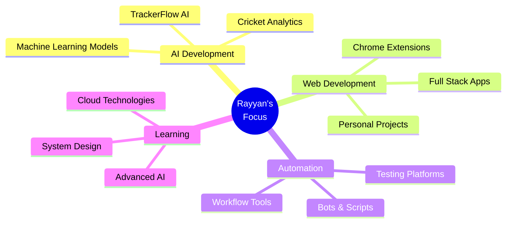

<div align="center">

# 👨‍💻 Muhammad Rayyan Moosani


<p align="center">
  
</p>

[](https://github.com/Muhammad-Rayyan-Moosani)

</div>

---

## 🚀 About Me

```python
class RayyanMoosani:
    def __init__(self):
        self.username = "Muhammad-Rayyan-Moosani"
        self.role = "AI Engineer & Full Stack Developer"
        self.location = "🌍 Building the Future"
        self.interests = [
            "Artificial Intelligence",
            "Machine Learning",
            "Web Development",
            "Automation",
            "Cricket Analytics"
        ]
        self.current_focus = "Building AI-powered solutions"

    def say_hi(self):
        print("Thanks for dropping by! Let's build something amazing together!")

me = RayyanMoosani()
me.say_hi()
```

---

## 🛠️ Technical Skills

<div align="center">

### 💻 Languages


### ⚛️ Frameworks & Libraries


### ☁️ Cloud & DevOps


</div>

---

## 🎯 Featured Projects

<table align="center">
<tr>
<td width="50%">

### 🤖 TrackerFlow AI
Chrome extension that generates custom AI-powered trackers for tasks, habits, expenses, and studies using Flask and OpenAI.

**Tech:** Python, Flask, OpenAI API, JavaScript

[](https://github.com/Muhammad-Rayyan-Moosani/TrackerFlow-AI)

</td>
<td width="50%">

### 🏏 CrickAI Vision
AI-powered cricket analytics and prediction system leveraging Google Gemini for advanced match insights.

**Tech:** Python, Google Gemini, Machine Learning

[](https://github.com/Muhammad-Rayyan-Moosani/CrickAI-Vision)

</td>
</tr>
<tr>
<td width="50%">

### 🧪 TestGuard Platform
Automated UI testing engine using Selenium and WebDriverIO for comprehensive validation and quality assurance.

**Tech:** Selenium, WebDriverIO, JavaScript

[](https://github.com/Muhammad-Rayyan-Moosani/TestGuard-Platform)

</td>
<td width="50%">

### 🌐 Personal Website
Modern portfolio website showcasing projects and skills with responsive design.

**Tech:** JavaScript, HTML, CSS

[](https://github.com/Muhammad-Rayyan-Moosani/Personal-Website)
[](https://www.rayyanmoosani.com/)

</td>
</tr>
</table>

---

## 💡 What I'm Up To

<div align="center">



</div>

---

## 📫 Let's Connect!

<div align="center">

[](https://www.rayyanmoosani.com/)
[](https://www.linkedin.com/in/rayyan-moosani/)
[](mailto:mrayyanm411@gmail.com)
[](https://twitter.com/RayyanMoosani)
[](https://www.instagram.com/rayyan_moosani)

</div>

---

<div align="center">

### 💭 Random Dev Quote


### 🐍 Contribution Snake

<picture>
  <source media="(prefers-color-scheme: dark)" srcset="https://raw.githubusercontent.com/Muhammad-Rayyan-Moosani/Muhammad-Rayyan-Moosani/output/github-contribution-grid-snake-dark.svg">
  <source media="(prefers-color-scheme: light)" srcset="https://raw.githubusercontent.com/Muhammad-Rayyan-Moosani/Muhammad-Rayyan-Moosani/output/github-contribution-grid-snake.svg">
  
</picture>

</div>

---

<div align="center">


</div>
